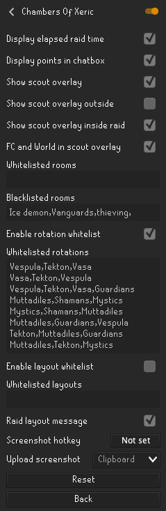

# Scout Bot

RuneScape scout bot machine vision project for scouting.


Table of contents
=================
* [Test Account](#test-account)
* [Documents](#documents)
* [Infrastructure](#infrastructure)
* [Install](#install)
* [Samples](#samples)
* [Troubleshooting](#troubleshooting)
* [Hints](#hints)
* [Plugin config](#plugin-config)
    * [CoX Scouter External](#cox-scouter-external)
    * [Chambers Of Xeric](#chambers-of-xeric)


Test Account
============
None at the moment...


Documents
============
Documents for development.

* Project Google Drive folder:  
    https://drive.google.com/drive/folders/1Bjp6M0aU6s2qkTvNfAAzTgtLijzt2ykQ?usp=sharing
* Random mouse curve possibility:  
    https://stackoverflow.com/questions/44467329/pyautogui-mouse-movement-with-bezier-curve

Infrastructure
============
Infra...


Install
============

1. Install Python 3.6 https://www.python.org/downloads/release/python-3613/
2. `pip install -r requirements.txt` to install needed dependencies.
3. Rename `config_template.ini` into `config.ini`
4. Get game window position with `Mouse.py` script. Positions are left top and bottom right corners.
    ```text
    0,0       X increases -->
    +---------------------------+
    |                           | Y increases
    |                           |     |
    |   1920 x 1080 screen      |     |
    |                           |     V
    |                           |
    |                           |
    +---------------------------+ 1919, 1079
    ```
5. Define configuration separating them by `;` and defining target strategy.
    ```ini
    [bot]
    game_names=RUNE1;RUNE2
    game_frames=0,80,1100,700;0,80,1100,700
    strategies=scout;scout
    ```
6. Run `Scout.py` 


Samples
============
Running program sample

```python
...
```

Troubleshooting
============

1. Screen capture does not capture window
    * See system security and privacy settings for possible permissions.  
2. Mouse does not move automatically
    * See system security and privacy settings for possible permissions.  


Hints
============
Some command hints for python

See installed libraries and their version.
```shell script
pip freeze
```


RuneLite settings
============
Check RuneLite settings overlay color opacity.


Plugin config
============

RaidReloader
-----
RaidReloader must be installed.

CoX Scouter External
-----


Highlight color code: `#2D251F`


Chambers Of Xeric
-----




Blacklisted rooms:
```txt
Ice demon,Vanguards,thieving,
```

Whitelisted rotations:
```txt
Vespula,Tekton,Vasa
Vasa,Tekton,Vespula
Vespula,Tekton,Vasa,Guardians
Muttadiles,Shamans,Mystics
Mystics,Shamans,Muttadiles
Muttadiles,Guardians,Vespula
Tekton,Muttadiles,Guardians
Muttadiles,Tekton,Mystics
```
